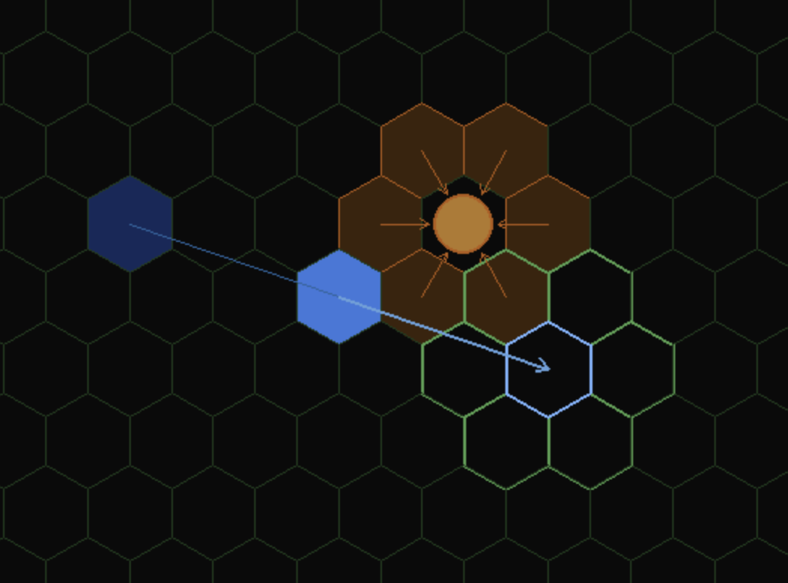

# hexvector

In space, no one can hear you stop. This pygame sandbox demonstrates
Newtonian vector movement on a hex grid — momentum, thrust, and gravity
assists — inspired by the 1978 GDW board game Mayday.

---

## What is this?

A spaceship is tracked by three position markers: past, present, and future.
Your future position is determined by extending the line from past through
present — that is your momentum, and it carries you forward whether you
like it or not. Each turn you may shift that future position by one hex
using thrust. The planet's gravity will shift it too, whether you ask it
to or not.



---

## How to explore hexvector

- The ring of bright outlined hexes shows where you can thrust. Click one
  to aim your future position there.
- Press **Space** or **Enter** to advance the turn.
- If you don't click, you coast — momentum carries you to the natural
  future position.
- Your goal is to reach the target hex, marked **X**, in as few turns
  as possible.
- Do not hit the planet at speed. Impact above 1 hex/turn destroys the ship.
- Press **Escape** to reset. Press **Q** to quit.

---

## Installation

Requires Python 3.12+.

```
git clone https://github.com/since1968/hexvector.git
cd hexvector
pip install -r requirements.txt
python3 main.py
```

---

## Physics model

**Momentum.** A ship in motion stays in motion. Your velocity is the
vector from your past position to your present position. Each turn that
vector is extended forward automatically — your future marker is placed
at the far end of that line. To stop, you must decelerate over multiple
turns. There is no braking.

**Thrust.** A 1G drive lets you shift your future position by one hex per
turn in any direction. This is applied after momentum places the future
marker, so thrust adjusts your trajectory rather than setting it. At 1G
you can nudge; you cannot pivot. Higher G ratings shift the future marker
further, but the underlying logic is the same.

**Gravity.** A world's gravity hexes are the six hexes surrounding it.
When your present-to-future path crosses a gravity hex, your future
marker is displaced one hex toward the world — mandatory, no saving
throw. Crossing two gravity hexes displaces twice. This is what makes a
gravity assist work: approach at the right angle and the planet bends your
trajectory for free, putting you on a faster course than a straight-line
burn would achieve.

---

## Gravity and the Slingshot Effect

Here is a concrete example of how gravity deflects a ship's trajectory,
using hex coordinates. The world is at Hex(9, 7). Its six surrounding
gravity hexes each carry a fixed impulse directed toward the world centre.

The ship starts heading east at speed 2: past at Hex(7, 6), present at
Hex(9, 6), future at Hex(11, 6).

**Turn 1.** The ship advances. Its path from Hex(7, 6) to Hex(9, 6) passes
through Hex(9, 6) itself — a gravity hex. That hex carries a northwest
impulse, which shifts the future marker one hex northwest, from Hex(11, 6)
to Hex(11, 7). The present-to-future distance is now 3, not 2. The ship
did not apply thrust; the planet did it.

**Turn 2.** The ship advances again. Its present is now Hex(9, 6), and
it moves to Hex(11, 7) — a speed-3 move, because last turn's gravity
stretched the vector. The path from Hex(9, 6) to Hex(11, 7) is three hexes
long and crosses two gravity hexes in sequence:

- Hex(10, 6): west impulse. In cube velocity terms, the ship's velocity
  (2, −3, 1) becomes (1, −3, 2) — magnitude stays 3.
- Hex(10, 7): southwest impulse. The velocity (1, −3, 2) becomes (0, −2, 2)
  — magnitude drops to 2.

The two impulses pull in slightly different directions. The first is
perpendicular enough to the velocity that it bends the course without
changing speed. The second opposes enough of the velocity's forward
component that speed returns to 2.

The ship exits the gravity field at speed 2 but on a noticeably different
heading than it entered — bent south and slowed back to its original pace.


---

## Inspiration

This project was inspired by the vector movement system in Mayday (Game
Designers' Workshop, 1978). The underlying physics — Newtonian mechanics
on a hex grid — is not owned by anyone. This project contains no rules
text, ship statistics, or scenario content from any copyrighted game.

The Traveller game in all forms is owned by Mongoose Publishing.
Copyright 1977–2025 Mongoose Publishing. Traveller is a registered
trademark of Mongoose Publishing. This project is non-commercial.

---

## License

MIT
